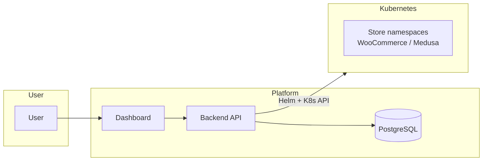

# Kubernetes Store Orchestration — Urumi Round 1

Store provisioning platform: React dashboard (Store Weaver) + Node.js API + Helm/Kubernetes. Each store runs in its own namespace (WooCommerce or Medusa), with persistent storage and Ingress.

**Stack:** Frontend (React + Vite + shadcn) → Backend (Node.js + TypeScript) → PostgreSQL → Helm → Kubernetes (k3d/k3s).

**Creator:** [@Angad-2002](https://github.com/Angad-2002)

---

## Table of contents

- [Architecture](#architecture)
- [Project layout](#project-layout)
- [Prerequisites](#prerequisites)
- [Local setup](#local-setup)
- [Auth](#auth-sign-in--sign-up)
- [Create a store and place an order](#create-a-store-and-place-an-order-definition-of-done)
- [API](#api-backend)
- [Production](#production-k3s-on-vps)
- [Technology stack](#technology-stack)
- [Documentation](#documentation)
- [Troubleshooting](#troubleshooting)
- [Author](#author)

---

## Architecture

High-level flow: the **dashboard** talks to the **backend** API; the backend stores metadata in **PostgreSQL** and provisions each store via **Helm** into a dedicated **Kubernetes** namespace (WooCommerce or Medusa). Stores are exposed via **Ingress** (e.g. Traefik).



| Component | Role |
|-----------|------|
| **Dashboard** | React SPA; create/list/delete stores, view status & detail; sends `X-User-Id`. |
| **Backend** | Express API + store logic; Helm install/uninstall; K8s monitoring; quotas. |
| **PostgreSQL** | Store metadata (id, name, namespace, status, url). |
| **Helm charts** | One namespace per store; WordPress+MySQL (WooCommerce) or Medusa+Postgres+Redis. |

### Component interactions

- **Dashboard** → `GET/POST /api/stores`, `GET/DELETE /api/stores/:id`, `GET /api/stores/:id/detail`, `POST /api/stores/:id/retry` (optional header `X-User-Id`).
- **Backend** → **store.service** (create, list, get, retry, delete, detail); **helm.service** (install / installMedusa / uninstall); **kubernetes.service** (namespaces, resources, events); **monitor.service** (waitForReady); **store.repository** → PostgreSQL.

### Resource hierarchy (per store namespace)

Each store runs in a dedicated namespace (e.g. `store-mystore`). Typical resources:

```
Namespace: store-<slug>
├── Secret (mysql-secret / wordpress-secret or Medusa secrets)
├── Deployment (wordpress or {storeId}-medusa, optional redis/storefront)
├── StatefulSet (mysql or {storeId}-postgres)
├── Service (wordpress, mysql or medusa, postgres, redis)
├── PersistentVolumeClaim (DB + optional app storage)
├── Ingress (wordpress-ingress or {storeId}-ingress)
└── ResourceQuota (optional; enabled in values-prod)
```

Full diagrams, provisioning/delete sequences, and data model: [docs/ARCHITECTURE.md](docs/ARCHITECTURE.md).

---

## Project layout

| Path | Description |
|------|-------------|
| **[frontend/](frontend/README.md)** | Store Weaver dashboard. Create/list/delete stores, view status, resources, events. Set `VITE_API_URL` to the backend base URL (e.g. `http://localhost:3000`); omit for mock data. |
| **[backend/](backend/README.md)** | API + provisioning. Express + Knex + PostgreSQL; store CRUD, Helm install/uninstall, K8s monitoring, retry, store detail. |
| **[helm/store/](helm/store/README.md)** | Per-store chart for **WooCommerce** (WordPress + MySQL, Ingress, optional ResourceQuota). Use `values-local.yaml` or `values-prod.yaml`. |
| **[helm/medusa-store/](helm/medusa-store/README.md)** | Per-store chart for **Medusa** (Medusa backend + PostgreSQL + Redis, optional Next.js storefront). Used when you create a store with engine **Medusa**. |
| **[docker/](docker/README.md)** | Image build context: [wordpress-woocommerce](docker/wordpress-woocommerce/README.md), [medusa-backend](docker/medusa-backend/README.md), [medusa-storefront](docker/medusa-storefront/README.md) (optional). |
| **[docs/](docs/README.md)** | Design and architecture. [docs/ARCHITECTURE.md](docs/ARCHITECTURE.md) — architecture diagrams (components, flows, K8s layout). [docs/SYSTEM_DESIGN.md](docs/SYSTEM_DESIGN.md) — tradeoffs, production vs local, scaling. |

---

## Prerequisites

- Node.js 20+
- PostgreSQL 15+ (or Docker)
- Docker (for store images and k3d)
- kubectl, Helm 3, k3d (or Minikube / Kind)

---

## Local setup

### 1. Kubernetes (k3d)

```bash
k3d cluster create store-platform --port "80:80@loadbalancer"
kubectl cluster-info
```

### 2. Database

```bash
docker run -d --name storeplatform-db \
  -e POSTGRES_DB=storeplatform \
  -e POSTGRES_USER=storeplatform \
  -e POSTGRES_PASSWORD=storeplatform123 \
  -p 5432:5432 \
  postgres:15
```

### 3. WordPress + WooCommerce image

Build and import (see [docker/wordpress-woocommerce/README.md](docker/wordpress-woocommerce/README.md)):

```bash
cd docker/wordpress-woocommerce
docker build -t storeplatform/wordpress-woocommerce:latest .
k3d image import storeplatform/wordpress-woocommerce:latest -c store-platform
```

### 4. Backend

```bash
cd backend
cp .env.example .env
```

Set in `.env`: `DATABASE_URL`, `KUBECONFIG`, `HELM_CHART_PATH` (e.g. `../helm/store`), `HELM_CHART_PATH_MEDUSA` (e.g. `../helm/medusa-store`), and optionally `LOCAL_INGRESS_SUFFIX=.localhost`.

```bash
npm install
npm run migrate
npm run dev
```

API: **http://localhost:3000** — `GET/POST /api/stores`, `GET/DELETE /api/stores/:id`, `GET /api/stores/:id/status`, `GET /api/stores/:id/detail`, `POST /api/stores/:id/retry`, `GET /api/health`.

### 5. Dashboard (Store Weaver)

```bash
cd frontend
cp .env.example .env
```

Set `VITE_API_URL=http://localhost:3000` (no trailing slash) to use the backend; omit or leave empty to use mock data.

```bash
npm install
npm run dev
```

Dashboard: **http://localhost:5173** (or port shown by Vite). Sign in (any email + any password ≥ 6 chars; see [Auth](#auth) below), then create/list/delete stores.

Without Kubernetes you can still run backend and frontend; leave `VITE_API_URL` unset to use mock data in the dashboard.

---

## Auth (sign in / sign up)

Sign in and sign up exist **only in the frontend**:

- The dialog collects **email** and **password** (min 6 characters). The app uses **email** to build a user id (e.g. `user-yourexamplecom`) and stores it in React state; the **password is not sent** to the backend.
- The backend has **no** login/signup endpoints. It reads the **`X-User-Id`** header (set by the frontend when signed in) to filter stores and enforce the per-user store limit.

Auth is **demo-style**: fine for local use and the assignment. For production you’d add a real auth layer (user table, signup/login, JWT or sessions, and backend validation).

---

## Create a store and place an order (Definition of Done)

1. Open the dashboard (e.g. **http://localhost:5173**), sign in, click **New Store**.
2. Enter a store name and choose **WooCommerce** or **Medusa**, then **Create Store**.
3. Wait until status is **Ready**. The store URL appears (e.g. `acme-electronics.localhost`).
4. **WooCommerce:** Open the store URL → WordPress/WooCommerce storefront. Add product to cart → Checkout → Cash on delivery → Place order. Confirm in **Admin** (e.g. `http://acme-electronics.localhost/wp-admin`) → WooCommerce → Orders.
5. **Medusa:** Open the store URL (API) or Admin at `{url}/app`. Build and load the Medusa backend image first: see [docker/medusa-backend/README.md](docker/medusa-backend/README.md).

**Local URLs:** If `*.localhost` does not resolve, add to `hosts` or set in backend `.env`: `LOCAL_INGRESS_SUFFIX=.127.0.0.1.nip.io`.

---

## API (backend)

- **Create:** `POST /api/stores` — body: `{ "name": "My Store", "engine": "woocommerce" }`. Optional header: `X-User-Id` for per-user store limit.
- **List:** `GET /api/stores` — optional `X-User-Id` to filter by user.
- **Get:** `GET /api/stores/:id`, `GET /api/stores/:id/status`, `GET /api/stores/:id/detail` (resources + events from K8s).
- **Retry:** `POST /api/stores/:id/retry` — re-provision a failed store.
- **Delete:** `DELETE /api/stores/:id` — Helm uninstall, namespace delete, DB remove.

---

## Production (k3s on VPS)

Use the same Helm charts with `values-prod.yaml`. Backend: `ENVIRONMENT=production`, `PROD_INGRESS_SUFFIX=.yourdomain.com`, `DATABASE_URL`, `KUBECONFIG`. DNS: wildcard `*.yourdomain.com` → VPS IP. See [docs/SYSTEM_DESIGN.md](docs/SYSTEM_DESIGN.md) and [helm/store/values-prod.yaml](helm/store/values-prod.yaml) for TLS and resource hints.

---

## Technology stack

| Layer | Technologies |
|-------|--------------|
| **Frontend** | React 18, Vite, TypeScript, shadcn/ui, Tailwind CSS |
| **Backend** | Node.js 20, Express, TypeScript, Knex, PostgreSQL 15 |
| **Provisioning** | Helm 3, @kubernetes/client-node, Helm CLI (exec) |
| **Store engines** | WooCommerce (WordPress + MySQL 8), Medusa (PostgreSQL, Redis, optional Next.js storefront) |
| **Infrastructure** | Kubernetes (k3d / k3s), Traefik Ingress, Docker |

---

## Documentation

- [docs/README.md](docs/README.md) — Documentation index
- [docs/ARCHITECTURE.md](docs/ARCHITECTURE.md) — **Architecture diagrams** (system, backend, provisioning/delete flows, Kubernetes per-store layout, data model)
- [docs/SYSTEM_DESIGN.md](docs/SYSTEM_DESIGN.md) — System design, idempotency, cleanup, production vs local, isolation, security, scaling

---

## Troubleshooting

| Issue | What to check |
|-------|----------------|
| **Backend won’t start** | `DATABASE_URL` correct; PostgreSQL running; `npm run migrate` run. |
| **Dashboard shows no stores** | `VITE_API_URL` set to backend URL (e.g. `http://localhost:3000`) and backend running. |
| **Store stuck in Provisioning** | k3d/kubectl context correct; Helm chart path in backend `.env`; store image built and imported (see [docker/](docker/README.md)). |
| **`*.localhost` not resolving** | Use `LOCAL_INGRESS_SUFFIX=.127.0.0.1.nip.io` in backend `.env` or add hosts entry. |
| **Helm install failed** | `helm version` and `kubectl get nodes`; ensure cluster name matches (e.g. `-c store-platform` for k3d). |

More: [backend/README.md](backend/README.md), [helm/README.md](helm/README.md).

---

## Author

**Angad**  
GitHub: [@Angad-2002](https://github.com/Angad-2002)

This project was created as part of the Urumi AI SDE internship — Round 1 (Kubernetes Store Orchestration).
