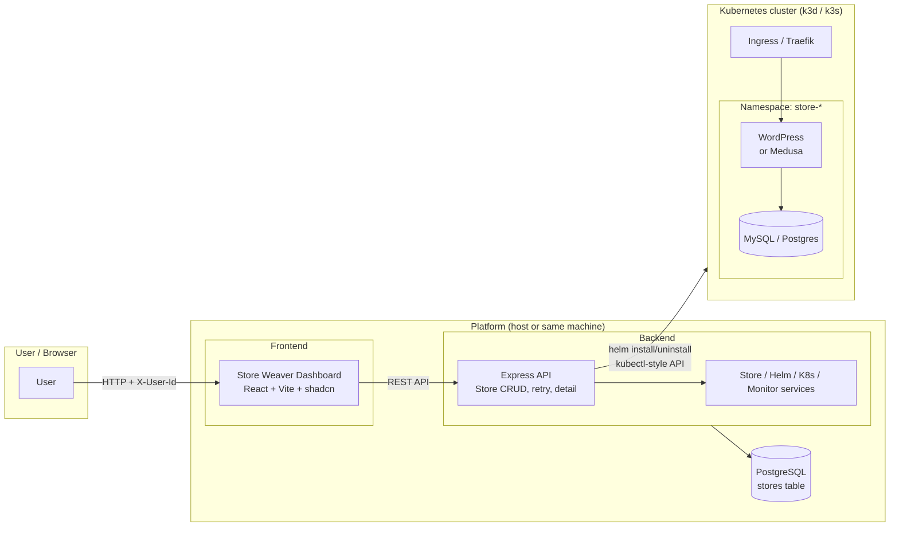
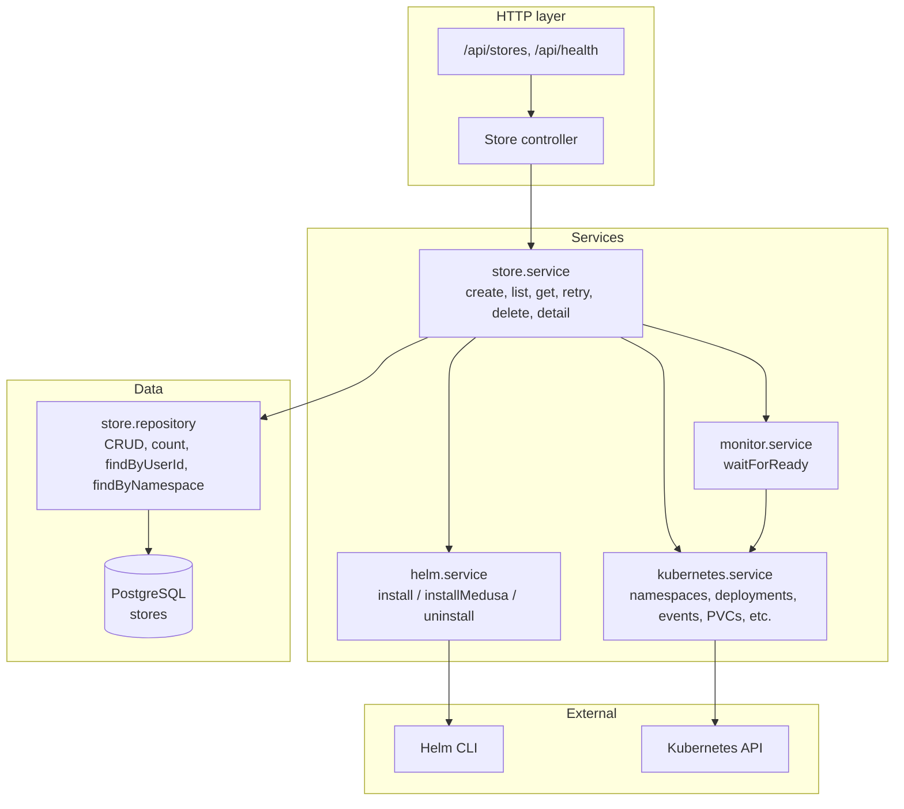
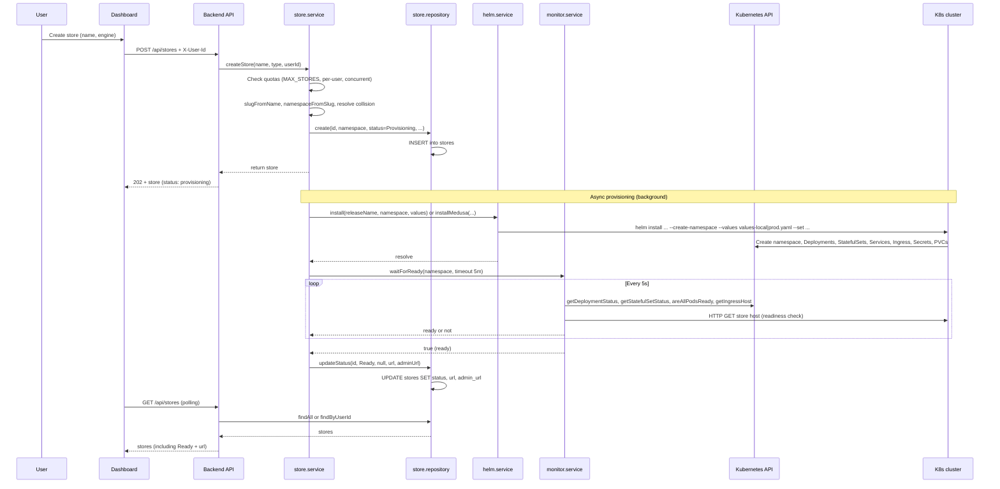
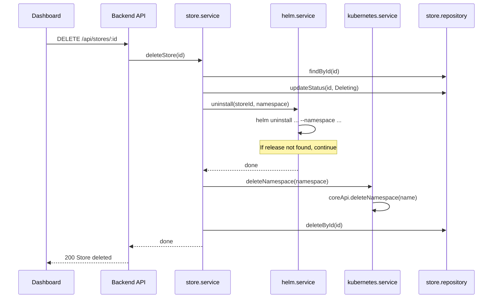
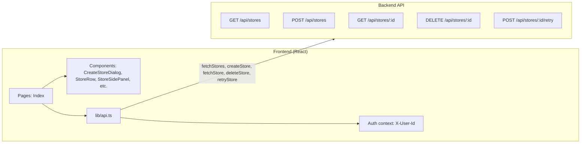

# Architecture

This document describes the architecture of the Kubernetes Store Orchestration platform (Store Weaver): components, data flow, provisioning lifecycle, and Kubernetes resource layout. It is based on the actual codebase in `backend/`, `frontend/`, `helm/`, and `docker/`.

**Creator:** [@Angad-2002](https://github.com/Angad-2002)

---

## 1. High-level system architecture

The platform has three main parts: a **React dashboard** (Store Weaver), a **Node.js backend** (API + provisioning), and **Kubernetes** where each store runs in its own namespace. The backend uses **PostgreSQL** as the source of truth for store metadata and **Helm** to deploy store charts.



**Summary:**

- **User** interacts only with the **Store Weaver dashboard** (sign-in, create/list/delete stores, view status and detail).
- **Dashboard** calls the **backend** REST API; sends optional `X-User-Id` for per-user store list and quotas.
- **Backend** persists store metadata in **PostgreSQL** and provisions stores by running **Helm** against the **Kubernetes** cluster (one namespace per store). It also uses the Kubernetes API to monitor readiness and to serve store detail (resources, events).
- **Stores** are exposed via **Ingress** (e.g. Traefik); each store has its own host (e.g. `mystore.localhost` or `mystore.yourdomain.com`).

---

## 2. Backend internal architecture

The backend is a single Node.js process. It exposes REST routes and delegates to **services** for store logic, Helm, Kubernetes, and readiness monitoring. **Repositories** and **Knex** access PostgreSQL.



**Flow:**

- **Store controller** parses requests, reads `X-User-Id`, and calls **store.service** for all store operations.
- **store.service** enforces quotas (`MAX_STORES`, `MAX_STORES_PER_USER`, `MAX_CONCURRENT_PROVISIONS`), creates the DB row, then runs **provisionStoreAsync** (or retry/delete). For create: it calls **helm.service** to install the chart, then **monitor.service** to wait until the store is ready; on failure it cleans up via **helm.service** (uninstall) and **kubernetes.service** (delete namespace). For **getStoreDetail** it uses **kubernetes.service** to list resources, events, pod restarts, and resource usage.
- **helm.service** builds `helm install` / `helm uninstall` commands (with `values-local.yaml` or `values-prod.yaml` and `--set` for secrets and ingress host) and runs them via **exec** (Helm CLI).
- **kubernetes.service** uses `@kubernetes/client-node` (CoreV1, AppsV1, NetworkingV1) to create/delete namespaces, list deployments/statefulsets/services/pods/PVCs/ingresses/secrets, list events, and compute resource usage.
- **monitor.service** polls **kubernetes.service** (and optionally HTTP health on the store host) until the store is ready or timeout (5 minutes).

---

## 3. Provisioning flow (create store)

End-to-end flow from “Create Store” in the dashboard to “Ready” (or “Failed”).



**Failure path:** If Helm install or waitForReady fails, **store.service** calls **helm.service.uninstall** and **kubernetes.service.deleteNamespace**, then **store.repository.updateStatus(id, 'Failed', error_message)**. The dashboard shows status “Failed” and optional retry.

---

## 4. Delete store flow



---

## 5. Kubernetes: per-store namespace layout

Each store gets a **dedicated namespace** (e.g. `store-mystore` or `store-mystore-abc123` if the slug collides). All store resources live in that namespace. The backend never puts platform-wide resources in store namespaces.

### 5.1 WooCommerce store (helm/store)

| Resource type   | Name / pattern        | Purpose |
|-----------------|------------------------|---------|
| Namespace       | `store-<slug>`         | Isolation boundary |
| Secret          | `mysql-secret`         | DB credentials (from backend --set) |
| Secret          | `wordpress-secret`     | WordPress admin (from backend --set) |
| Deployment      | `wordpress`            | WordPress + WooCommerce image |
| StatefulSet     | `mysql`                | MySQL 8.0 |
| Service         | `wordpress`            | Front-end traffic |
| Service         | `mysql`                | DB traffic |
| PersistentVolumeClaim | MySQL PVC         | Persistent DB storage |
| Ingress         | `wordpress-ingress`    | Host-based routing (e.g. mystore.localhost) |
| ResourceQuota   | (optional)            | Enabled in values-prod |

Image: `storeplatform/wordpress-woocommerce:latest` (built from `docker/wordpress-woocommerce`).

### 5.2 Medusa store (helm/medusa-store)

| Resource type   | Name / pattern           | Purpose |
|-----------------|---------------------------|---------|
| Namespace       | `store-<slug>`            | Isolation boundary |
| Secret          | Postgres, Medusa, Redis   | Credentials (from backend --set) |
| ConfigMap       | Medusa config             | App config |
| Deployment      | `{storeId}-medusa`         | Medusa API + Admin |
| Deployment      | `{storeId}-redis`         | Redis (optional storefront disabled in local) |
| Deployment      | `{storeId}-storefront`    | Next.js storefront (optional) |
| StatefulSet     | `{storeId}-postgres`      | PostgreSQL |
| Service         | (per component)          | ClusterIP / NodePort |
| PersistentVolumeClaim | Postgres + Redis PVCs | Persistent storage |
| Ingress         | `{storeId}-ingress`       | Host-based routing |
| Job             | Medusa init job           | Migrations / seed |

Image: `medusa-backend:latest` (built from `docker/medusa-backend`). Optional: `medusa-storefront:latest` from `docker/medusa-storefront` when storefront is enabled.

### 5.3 Namespace isolation diagram

```mermaid
flowchart TB
  subgraph Platform["Platform (outside cluster)"]
    Backend[Backend]
  end

  subgraph K8s["Kubernetes cluster"]
    Ingress[Traefik / Ingress]
    subgraph NS1["Namespace: store-shop1"]
      WP1[WordPress]
      MySQL1[(MySQL)]
      Svc1[Services]
      PVC1[PVC]
      WP1 --> MySQL1
    end
    subgraph NS2["Namespace: store-medusa2"]
      Med[Medusa]
      PG[(PostgreSQL)]
      Redis[Redis]
      Svc2[Services]
      PVC2[PVC]
      Med --> PG
      Med --> Redis
    end
    Ingress --> WP1
    Ingress --> Med
  end

  Backend -->|helm install/uninstall<br/>K8s API (list/watch)| K8s
```

---

## 6. Data model (PostgreSQL)

Single table **stores** (see `backend/src/migrations/`):

| Column         | Type       | Description |
|----------------|------------|-------------|
| id             | string PK  | Unique store id (e.g. 12-char generated) |
| type           | string     | `woocommerce` or `medusa` |
| name           | string     | Display name |
| namespace      | string UK  | K8s namespace (e.g. `store-mystore`) |
| status         | string     | `Provisioning`, `Ready`, `Failed`, `Deleting` |
| url            | string     | Store front URL (set when Ready) |
| admin_url      | string     | Admin URL (e.g. /wp-admin or /app) |
| error_message  | text       | Set when status = Failed |
| user_id        | string     | Optional; from X-User-Id for per-user list and quota |
| created_at     | timestamp  | |
| updated_at     | timestamp  | |

The backend is the only writer. Kubernetes state (resources, events) is read live via the Kubernetes API for the “detail” view and is not stored in PostgreSQL.

---

## 7. Frontend (Store Weaver) and API usage



- **List:** `GET /api/stores` with optional `X-User-Id`; response `{ stores: [...] }`.
- **Create:** `POST /api/stores` with body `{ name, engine }` and optional `X-User-Id`; returns 202 and store with status `provisioning`.
- **Detail:** `GET /api/stores/:id` returns store plus K8s-derived detail (resources, events, provisioning steps, quotas) when the backend is configured.
- **Delete:** `DELETE /api/stores/:id`; backend runs Helm uninstall, namespace delete, and DB delete.
- **Retry:** `POST /api/stores/:id/retry` for failed stores; backend sets status to Provisioning and re-runs provisioning.

Dashboard polls the list (and detail when the side panel is open) on an interval (e.g. 4–5s) so status and URL update without WebSockets.

---

## 8. Local vs production (summary)

| Aspect        | Local (k3d / kind / minikube)     | Production (k3s on VPS)              |
|---------------|------------------------------------|--------------------------------------|
| Helm values   | `values-local.yaml`                | `values-prod.yaml`                   |
| Ingress suffix| `LOCAL_INGRESS_SUFFIX` (e.g. .localhost) | `PROD_INGRESS_SUFFIX` (e.g. .yourdomain.com) |
| Backend env   | `ENVIRONMENT=local`                | `ENVIRONMENT=production`             |
| Store images  | Built and imported into k3d        | Pushed to registry; cluster pulls   |
| TLS           | Typically none                     | Optional (e.g. cert-manager) in prod values |
| ResourceQuota | Often disabled in store chart      | Enabled in values-prod               |

Same Helm charts and backend code are used for both; only configuration (values files and env) changes.

---

## Related

- [SYSTEM_DESIGN.md](SYSTEM_DESIGN.md) — Design tradeoffs, idempotency, cleanup, security, scaling.
- [../README.md](../README.md) — Setup and usage.
- [../backend/README.md](../backend/README.md) — API and services.
- [../helm/README.md](../helm/README.md) — Per-store charts.
